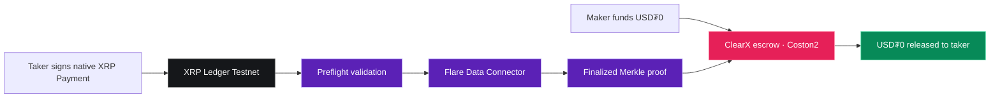

# ClearX

### Native XRP settlement without sending first

[](https://dev.flare.network/)
[](https://testnet.xrpl.org/)
[](https://dev.flare.network/fdc/overview)
[](#verification)
[](LICENSE)

ClearX is a non-custodial payment-versus-payment marketplace between native XRP on XRP Ledger and USD₮0 on Flare. A maker funds an escrow on Coston2, a taker pays XRP directly to the maker, and Flare Data Connector proves the external-chain payment before the contract releases USD₮0.

> **Flare Summer Signal · Bounty 1: Interoperable Asset Products**
>
> Target users: OTC traders, treasury operators, XRP holders, market makers, and counterparties who need verifiable bilateral settlement.

## The problem

Cross-chain OTC trades still depend on one party sending first, a trusted intermediary holding funds, or wrapped assets that change the asset being exchanged. Screenshots and transaction links are evidence for humans, but an EVM contract cannot independently enforce settlement from them.

## The solution

ClearX locks the Flare-side asset before XRP moves. Native XRP travels directly between external XRPL wallets with a trade-specific 32-byte memo. The relayer requests an official FDC attestation, retrieves the finalized proof, and submits it to the ClearX contract. The contract verifies sender, receiver, amount, memo, timestamp, status, proof owner, and replay state before releasing escrow.

| Property | ClearX approach |
|---|---|
| Custody | Neither XRP nor XRPL seeds are held by ClearX |
| XRP payment | Native XRPL `Payment`, signed with GemWallet or an external signer |
| Flare asset | Real test USD₮0 locked in the verified Coston2 contract |
| Cross-chain truth | Official Flare Data Connector payment attestation |
| Settlement | Smart-contract enforced release after proof verification |
| Recovery | Maker cancellation and deadline plus proof-grace reclaim paths |

## Live testnet protocol

| Item | Verified value |
|---|---|
| ClearX contract | [`0xf8c3682A1C3cCE91FF3709Cc4907681c98dC0Ce4`](https://coston2-explorer.flare.network/address/0xf8c3682A1C3cCE91FF3709Cc4907681c98dC0Ce4#code) |
| Deployment transaction | [`0x6e04…33d2`](https://coston2-explorer.flare.network/tx/0x6e04e319f4956899e9ba18147145adf353c43db1ffca626997a99141d4f233d2) |
| Test USD₮0 | [`0xC1A5B41512496B80903D1f32d6dEa3a73212E71F`](https://coston2-explorer.flare.network/address/0xC1A5B41512496B80903D1f32d6dEa3a73212E71F) |
| Network | Flare Coston2, chain ID `114` |
| Source | Verified on Coston2 Explorer |

## Proven end-to-end settlement

Trade `#1` completed on public testnets: the maker locked `5 test USD₮0`, the taker paid `10 test XRP`, FDC finalized voting round `1425351`, and the verified proof released escrow to the taker.

| Evidence | Public transaction |
|---|---|
| Funded trade | [`0x3db295…b3c53`](https://coston2-explorer.flare.network/tx/0x3db2950b8421d26bf175e536c11eb72199b73f44295ae0541950fb373f3b3c53) |
| Taker reservation | [`0xa3eecb…8d34`](https://coston2-explorer.flare.network/tx/0xa3eecb4a0b420047a5eb25946cf19963143df994177732667678bccfb8b48d34) |
| Native XRP payment | [`4EE488…28172`](https://testnet.xrpl.org/transactions/4EE4880D6BC32082094B8F069C809D8C69CA5049D8B6CC61EE62C461C4128172) |
| FDC request | [`0xede8f8…6b10a`](https://coston2-explorer.flare.network/tx/0xede8f8f6655fafe68fa0f33a4a2882cf439bbd428e33508c3a352c9d1f16b10a) |
| FDC consensus | [Voting round `1425351`](https://coston2-systems-explorer.flare.network/voting-round/1425351?tab=fdc) |
| USD₮0 release | [`0xc01126…2fcf1`](https://coston2-explorer.flare.network/tx/0xc01126e7e0a6edc2b2fe26c21eb85bbe30ce8750a980d53e602f044ba442fcf1) |

The maker received 10 XRP, the taker received 5 USD₮0, and contract escrow returned to zero. Machine-readable identifiers are preserved in [`demo-evidence.json`](demo-evidence.json).

## How it works



1. Maker approves and locks USD₮0 with the receiving XRPL address and exact XRP amount.
2. Taker reserves the funded trade, binding their Coston2 and XRPL identities.
3. GemWallet signs a native XRP payment with the required single 32-byte memo.
4. The API validates the transaction before spending relayer gas or FDC fees.
5. FDC reaches decentralized consensus and publishes the proof.
6. ClearX verifies every invariant and releases USD₮0 to the bound taker.

## Why Flare is essential

ClearX is not an interface with a superficial wallet connection. The Coston2 contract cannot know what happened on XRPL without a trustworthy external-data protocol. FDC converts the validated native XRP payment into a fact the contract can verify. Removing Flare removes the enforcement mechanism that makes non-custodial settlement possible.

## Product experience

- Fund and publish real Coston2 settlements.
- Discover already-funded offers in Open Markets.
- Track maker, taker, open, reserved, settled, cancelled, and expired states.
- Sign native XRP payments directly through GemWallet without exposing a seed.
- Fall back to any external XRPL signer by submitting its validated hash.
- Follow real XRP preflight, FDC request, consensus, proof, and release progress.
- View live XRP/USD market references without changing agreed contract amounts.
- Inspect Coston2, XRPL, and FDC evidence through the relevant explorers.

## What was built during Summer Signal

- Production smart-contract escrow with identity binding, replay protection, expiry recovery, and official FDC proof verification.
- Real XRPL `Payment` validation and public Coston2 FDC lifecycle.
- Persistent, restart-safe SQLite job engine with deduplication and rate limiting.
- GemWallet Testnet signing with exact single-memo payload and automatic FDC handoff.
- Responsive trading, market discovery, portfolio, settlement, and protocol interfaces.
- Live market-reference service with validation, caching, and stale fallback.
- A real public-testnet settlement with complete transaction evidence.

ClearX was built as a new Flare-native product for this hackathon. The core value is the implemented and demonstrated XRPL-to-Flare settlement path, not a pre-existing product with a token integration added later.

## Architecture and stack

`Solidity` · `Hardhat` · `OpenZeppelin` · `Flare FDC` · `XRPL` · `GemWallet` · `React` · `Vite` · `TypeScript` · `Wagmi` · `Viem` · `TanStack Query` · `Express` · `SQLite`

The relayer cannot fabricate settlement. `ClearXSettlement` independently calls Flare's verifier and checks the attested source, destination, amount, memo, status, timestamp, proof owner, and transaction replay state.

## Verification

```text
17 unit and integration tests
7 Solidity contract tests
35 responsive browser tests across 320, 375, 768, 1024 and 1440 px
TypeScript, ESLint and production build checks
1 completed real XRPL → FDC → Coston2 settlement
```

Test coverage includes contract state transitions, proof mismatches, XRP preflight failures, GemWallet rejection and malformed hashes, market-cache fallback, responsive overflow, wallet CTA visibility, and external-payment fallback.

## Security model

- ClearX never receives or stores an XRPL seed.
- XRP moves directly between externally controlled XRPL accounts.
- Private keys never enter frontend variables or committed files.
- Escrow state changes before token transfers and uses `SafeERC20` plus `ReentrancyGuard`.
- Every XRP transaction settles at most one trade.
- Late or mismatched payments cannot release escrow.
- Public FDC starts are preflighted, deduplicated, persisted, and rate-limited.
- The current deployment is testnet-only and must not be used with real funds.

## Roadmap

| Stage | Next milestone |
|---|---|
| Demo readiness | Public hosted app, judge walkthrough video, mobile wallet QA |
| Protocol hardening | Independent audit, richer relayer monitoring, indexed event discovery |
| Market usability | Quote expiry, reusable counterparties, notifications, settlement receipts |
| Asset expansion | Additional FDC-supported payment rails and Flare-side settlement assets |
| Production path | Mainnet risk review, production token verification, decentralized relayer model |

## Hackathon submission snapshot

- **Hackathon:** Flare Summer Signal
- **Selected bounty:** Bounty 1, Interoperable Asset Products
- **Project:** ClearX
- **Product:** Non-custodial native XRP versus Flare asset settlement
- **Deployment:** Flare Coston2 + XRPL Testnet
- **Repository:** [github.com/NikhilRaikwar/ClearX](https://github.com/NikhilRaikwar/ClearX)
- **Technical evidence:** [demo-evidence.json](demo-evidence.json)
- **Developer:** Nikhil Raikwar

## Documentation

- [Product requirements](CLEARX_PRD.md)
- [UI specification](CLEARX_UI_SPEC.md)
- [Flare/FDC verification](docs-verification.md)
- [Real settlement evidence](demo-evidence.json)

## License

Released under the [MIT License](LICENSE). Copyright © 2026 Nikhil Raikwar.
