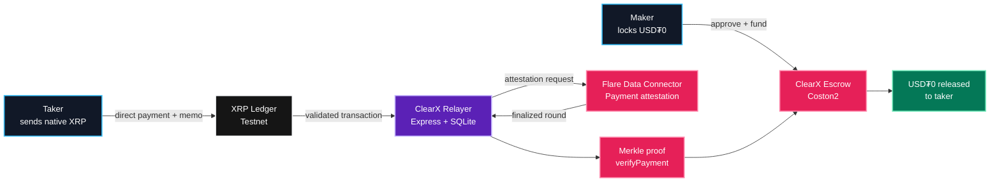

# ClearX

> Native XRP settlement without sending first.

ClearX is a non-custodial payment-versus-payment marketplace between native XRP on the XRP Ledger and test USD₮0 on Flare Coston2. A maker locks USD₮0, a taker pays XRP directly to the maker, and the Flare Data Connector proves that payment before the smart contract releases the locked asset.

[](https://dev.flare.network/)
[](https://testnet.xrpl.org/)
[](LICENSE)
[](https://www.typescriptlang.org/)

## Live protocol

| Item | Coston2 value |
|---|---|
| ClearX contract | [`0xf8c3682A1C3cCE91FF3709Cc4907681c98dC0Ce4`](https://coston2-explorer.flare.network/address/0xf8c3682A1C3cCE91FF3709Cc4907681c98dC0Ce4#code) |
| Deployment transaction | [`0x6e04…33d2`](https://coston2-explorer.flare.network/tx/0x6e04e319f4956899e9ba18147145adf353c43db1ffca626997a99141d4f233d2) |
| Test USD₮0 | [`0xC1A5B41512496B80903D1f32d6dEa3a73212E71F`](https://coston2-explorer.flare.network/address/0xC1A5B41512496B80903D1f32d6dEa3a73212E71F) |
| Chain ID | `114` |
| Contract source | Verified on Coston2 Explorer |

## Architecture



The relayer cannot fabricate settlement. `ClearXSettlement` independently calls Flare's official `verifyPayment(IPayment.Proof)` and validates the XRPL source, receiver, amount, memo reference, status, one-to-one semantics, timestamp, proof owner, and replay state.

## Core capabilities

- Real USD₮0 escrow, public/private listings, reservation, cancellation, and expiry recovery.
- Direct native XRP payment; ClearX never receives or stores an XRPL seed.
- Exact 32-byte payment reference carried in one XRPL `MemoData` field.
- Persistent FDC lifecycle with SQLite restart recovery and request deduplication.
- Coston2 wallet switching, allowance and balance reads, contract writes, and explorer evidence.
- Responsive React interface for creating, discovering, tracking, and settling trades.
- Dockerized Express API and Vite frontend for a single Railway service.

## Technology

`Solidity` · `Hardhat` · `OpenZeppelin` · `Flare FDC` · `XRPL` · `React` · `Vite` · `TypeScript` · `Wagmi` · `Viem` · `TanStack Query` · `Express` · `SQLite` · `Docker`

## Quick start

Requirements: Node.js 22+, npm, an injected EVM wallet, and dedicated testnet-only accounts.

```powershell
npm install
Copy-Item .env.example .env
npm run contracts:compile
npm run dev
```

Open `http://localhost:5173`. The API listens on `http://localhost:3000`; Vite proxies `/api` in development.

Only place private keys in `.env` or encrypted Railway Variables. Never commit `.env`, reuse testnet keys on mainnet, or prefix a secret with `VITE_`.

## Environment

Start from [.env.example](.env.example). The important deployment variables are:

```dotenv
USDT0_ADDRESS=0xC1A5B41512496B80903D1f32d6dEa3a73212E71F
CLEARX_CONTRACT_ADDRESS=0xf8c3682A1C3cCE91FF3709Cc4907681c98dC0Ce4
CLEARX_DEPLOYMENT_BLOCK=34049903
DEPLOYER_PRIVATE_KEY=
FDC_RELAYER_PRIVATE_KEY=
```

The deployer key is needed only for contract deployment. The runtime service needs only the relayer key. XRPL seeds always remain in the user's external XRPL wallet or signing tool.

## Settlement flow

1. Maker approves ClearX and locks test USD₮0 with its XRPL receiving address.
2. Taker reserves the trade using a different Coston2 wallet and its XRPL source address.
3. Taker sends the exact XRP amount directly to the maker with the displayed 32-byte memo.
4. Taker submits the validated XRPL transaction hash to ClearX.
5. The API preflights the transaction before spending FDC fees.
6. The relayer submits a `Payment` attestation request with `sourceId = testXRP`.
7. After FDC finalization, the API retrieves the DA-layer Merkle proof.
8. The contract verifies the proof and transfers locked USD₮0 to the taker.

## Railway deployment

1. Create a Railway project from this GitHub repository.
2. Attach a persistent volume mounted at `/app/data`.
3. Set `JOB_DB_PATH=/app/data/clearx.sqlite`.
4. Add the public configuration from `.env.example`.
5. Add `FDC_RELAYER_PRIVATE_KEY` as an encrypted variable.
6. Do not add the deployer key to the permanent runtime.
7. Generate a public domain and set `PUBLIC_APP_URL`.
8. Verify `/api/health`, restart persistence, and a complete real settlement.

The included [Dockerfile](Dockerfile) and [railway.json](railway.json) package the frontend and API as one service.

## Verification

```powershell
npm run lint
npm run check
npm test
npm run test:contracts
npm run build
npm run test:e2e
```

The project includes Solidity invariant/state-transition tests, XRPL validation fixtures, TypeScript and lint checks, and Playwright desktop/mobile flows.

## Security model

- XRP moves directly between external XRPL accounts.
- USD₮0 moves only through the audited escrow state machine.
- Maker and taker EVM/XRPL identities are bound before settlement.
- Each XRPL transaction is usable only once.
- State changes occur before token transfers and use `SafeERC20` plus `ReentrancyGuard`.
- Late payments are rejected; makers have a 15-minute proof grace period before reclaim.
- Public FDC requests are validated, deduplicated, persisted, and rate-limited.
- ClearX is currently testnet-only and must not be used with real funds.

## Documentation

- [Product requirements](CLEARX_PRD.md)
- [UI specification](CLEARX_UI_SPEC.md)
- [Flare/FDC verification notes](docs-verification.md)
- [Real testnet evidence](demo-evidence.json)

## License

Released under the [MIT License](LICENSE). Copyright © 2026 Nikhil Raikwar.
